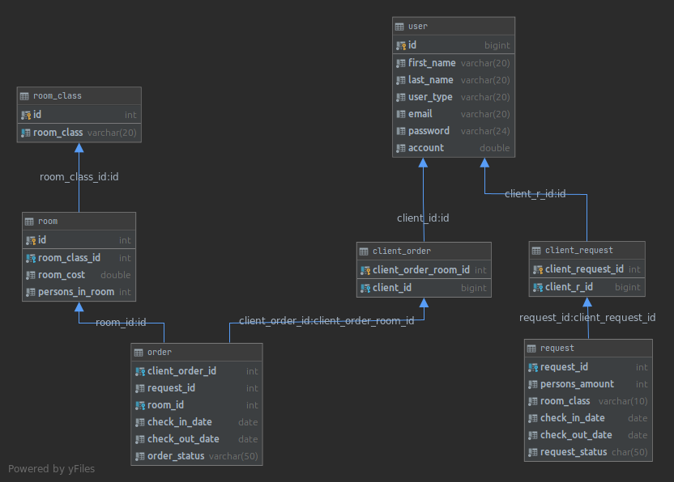

## Java Web Development course from EPAM - final task

### Base Task description:

System **Hotel booking**. 
- **The client** fills in the **Application** and send **Request**, indicating the number of beds in the room, the class of apartments
and the time of stay. 
- **The administrator** reviews the received **Request**, selects the most suitable available
**Room(s)**, 
- after which the system exposes **Invoice to the Client**.

### In Addition To A Base Task:
- an admin may reject a client's request
- a client can pay an invoice which sending by admin after the request approving
- a client has a balance of money that can be top-up
- after a client makes a request, an email sent to an admin
- after request approval by an admin, an email sent to a client
- admin can read on a webpage a listing of a log file created by log4j and stored on a server

### More:
- the current project is deployed on AWS platform and can be accessed on the following link http://hotelgrodno-env.eba-heanh92r.us-east-1.elasticbeanstalk.com/
- the current project can be run in a docker container (the docker configuration can be found in the "docker" folder)
- the current project also implemented using SPRING framework in a monolithic pattern. Can be found on the following link https://github.com/tarigor/epam-java-web-development-course-final-task-spring
- the current project also implemented using SPRING framework devided on microservices. Can be found on the following link https://github.com/tarigor/epam-java-web-development-course-final-task-spring-microservices

### Site Link:
http://hotelgrodno-env.eba-heanh92r.us-east-1.elasticbeanstalk.com/

### Requirements:

1. Store information about the subject area in the database (MySQL is recommended).
2. Based on the entities of the subject area, create classes describing them.
3. Implement the functionality proposed in the formulation of a specific task.
4. Classes and methods should have names reflecting their functionality and should be competently structured by packages.
5. When developing, use event logging (Log4j or similar).
6. The code must contain comments.
7. Use unit tests.
8. Use the build libraries.

### Resources

- factory/command.json - contains items of the commands factory
- factory/dao.json - contains items of the DAO factory
- factory/menu.json - contains items of the menu factory
- factory/services - contains items of the services factory
- local/local_by_BY.properties - contains the localization texts to English language
- local/local_en_US.properties - contains the localization texts to Belarusian language
- sql/1_hotel_db.sql - contains SQL statements to create the tables and stored procedures of the database for the current project.
- sql/2_hotel_db_room_class_init_data.sql - contains SQL statements to fill initial data for the "room" and "room_class" tables
- database.properties - contains the settings to initialize the MySQL database uses in the current project
- log4j.properties - contains the settings to initialize the logger - Log4j 
        
#### Technologies:

- Java (JDK 11)
- maven (build tool)
- apache tomcat 9.0.45
- Servlet API 3.1.0
- JSP API 2.1
- JSTL API 1.2
- gson 2.8.9
- commons-codec 1.11
- common-io 2.11.0
- javax.mail 1.6.2
- javax.activation 1.2.0
- log4j (logger) 1.2.17
- junit (testing) 4.13.2
- junit.jupiter 5.8.1
- mariaDB4j 2.5.0 (DAO layer testing)
- slf4j 1.7.32 (logging of mariaDB4j)

#### Database schema:

